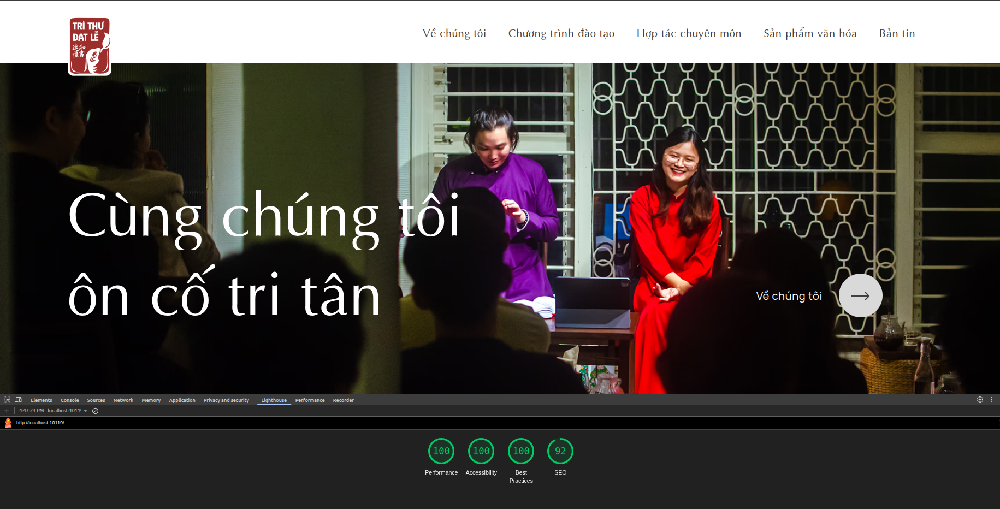

Àn nhon mn, đã một tuần trôi qua từ buổi họp team đầu tiên. Đến hôm nay em đã đúc kết được và muốn chia sẻ cho team cùng nắm tiến độ của dev web ạ:

1. Layout cơ bản hoàn thiện, em đang chuẩn bị các dạng nội dung, hình ảnh để đăng thử lên website.
2. Hiệu năng không phải vấn đề đáng lo ngại.

## Tiến độ đạt được

### 1. Giao diện trang chủ

Trang chủ cơ bản hoàn thiện layout, có smooth scrolling và transition giữa các section cơ bản. Để nâng cao trải nghiệm thì em sẽ tìm hiểu thêm về hiệu ứng animation phù hợp phong cách của TTDL. Animation hiện tại là để test hiệu năng của các thư viện thêm vào.

Dạo một vòng homepage:
[Video](https://vimeo.com/1092736983?share=copy)

### 2. Các trang khác cũng đã có layout

Những trang này cần có nội dung bên trong, hiện tại hình ảnh đang để placeholder.

#### Trang chủ > Sản phẩm văn hoá

#### Trang chủ > Sản phẩm văn hoá > Chi tiết sản phẩm

#### Trang chủ  >  Bản tin

#### Trang chủ  >  Bản tin  >  Bài viết

| Trang                                                   | % layout |
| ------------------------------------------------------- | -------- |
| Trang chủ                                               | 100%     |
| Trang chủ > Chương trình đào tạo                        | 70%      |
| Chương trình đào tạo > Nhóm lớp học                     | 80%      |
| Chương trình đào tạo > Nhóm lớp học > Thông tin mỗi lớp | 70%      |
| Trang chủ > Sản phẩm văn hoá                            | 100%      |
| Trang chủ > Sản phẩm văn hoá > Chi tiết sản phẩm        | 100%      |
| Trang chủ > Hợp tác chuyên môn                          | 90%      |
| Trang chủ > Hợp tác chuyên môn > Cố vấn văn hoá         | 90%      |
| Trang chủ > Bản tin                                     | 100%     |
| Trang chủ > Bản tin > Bài viết                          | 100%      |

## Tạm an tâm về hiệu năng

### Tối ưu performance

Mục tiêu của giai đoạn phát triển ban đầu là tối ưu hiệu năng của các trang. Khi hiệu năng tốt thì mới thêm các hiệu ứng để gia tăng trải nghiệm.

Dưới đây là bảng audit Lighthouse của các trang đang có. Em cố gắng để các chỉ số đều >95 (trừ SEO, lỗi thiếu meta description).

| Trang                                     | Performance | Accessibility | Best Practice | SEO |
| ----------------------------------------- | ----------- | ------------- | ------------- | --- |
| / (Trang chủ)                             | 100         | 100           | 100           | 92  |
| /chuong-trinh-dao-tao/                    | 100         | 100           | 100           | 83  |
| /chuong-trinh-dao-tao/van-hoa/            | 100         | 100           | 100           | 85  |
| /chuong-trinh-dao-tao/sang-tac/           | 100         | 100           | 100           | 85  |
| /chuong-trinh-dao-tao/nghe-thuat/         | 100         | 100           | 100           | 85  |
| /hop-tac-chuyen-mon/                      | 100         | 100           | 100           | 92  |
| /hop-tac-chuyen-mon/hop-tac-van-hoa/      | 100         | 100           | 100           | 85  |
| /hop-tac-chuyen-mon/viet-kich-ban/        | 100         | 100           | 100           | 85  |
| /hop-tac-chuyen-mon/co-van-truyen-thong/  | 100         | 100           | 100           | 85  |
| /san-pham-van-hoa/                        | 100         | 95            | 100           | 83  |
| /san-pham-van-hoa/bo-quat-nu-si-viet-nam/ | 100         | 100           | 100           | 92  |
| /ban-tin/                                 | 100         | 100           | 100           | 92  |
| /ban-tin/ke-phan-dien-la-ai/              | 99          | 100           | 100           | 92  |

### Font 'SVN-Optima' load ổn áp

Hiện tại website chỉ load các tài nguyên CSS, font và thư viện animation cơ bản. Và không khiến website nặng.

## Tiếp theo

### Xây dựng CMS bên trong

- Phân tích cấu trúc thông tin của website, viết tài liệu trong phần [Cấu trúc cấu trúc](/docs/intro).
- Yêu cầu thêm các trường thông tin em cần để đăng website. Phần này chắc em cập nhập trong file của chị Như ạ?

### Tiếp theo phát triển giao diện

- Nghiên cứu thêm về trải nghiệm trên website
- Canh chỉnh lại layout hiện tại cho sát với thiết kế.
- Chuẩn bị để layout cho mobile và các screen khác. Xem xét nên hỗ trợ màn hình retina (độ phân giải x2) như thế nào.
- Tìm hiểu thêm các state khác của các link, button (khi hover, active sẽ như thế nào).
