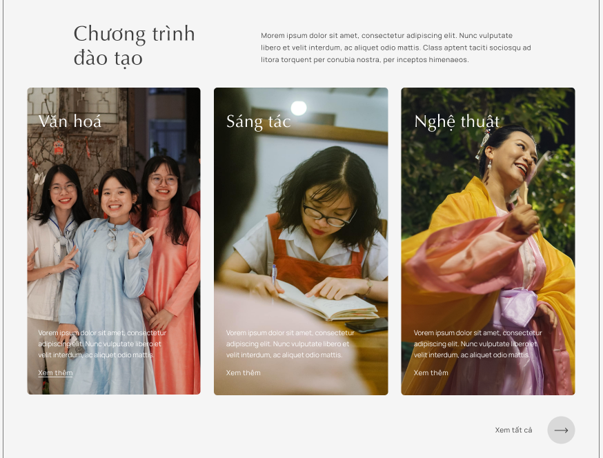

# Chương trình đào tạo

Các chương trình đào tạo ban đầu:

- Văn hóa
- Sáng tác
- Nghệ thuật

## Quản trị thông tin

Mỗi chương trình đào tạo có các trường thông tin sau:

- **Thumbnail Image**: (hình, 1200x630px) Dùng cho Share Facebook (OpenGraph)
- **Hero Image**: (hình, 1728x700px) Dùng cho trang template riêng. Dùng [link Canva](https://www.canva.com/design/DAGppjFO9gY/R1AWG3cb02VpYw8LX0Q3-A/edit?utm_content=DAGppjFO9gY&utm_campaign=designshare&utm_medium=link2&utm_source=sharebutton) sau để crop hình. Đặt tên: hero-ctdt-van-hoa-1728x700.png
- **Column Image**: (hình, 500x890px)
- **Archive Image**: (hình, 815x610px)
- **Title**: (text) Văn hóa
- **Excerpt**: (text, giới hạn SEO 125 kí tự)
- **Introduction**: (text, giới hạn 360 kí tự)
- **Goal**: (văn bản) (Mục tiêu chương trình)
- **Methodology**: (văn bản) (Phương pháp học tập)
- **Expected Outcome**: (văn bản) (Kết quả kỳ vọng)
- **Class Intro**: (văn bản) (Các lớp học)

## Quản trị quan hệ

Mỗi chương trình đào tạo sẽ có một hay nhiều [lớp học](lop-hoc/index.md).

Chương trình đào tạo không liên kết trực tiếp với: giảng viên, đồ án. (Không thể hiện trên UI)

Chương trình đào tạo liên kết gián tiếp với testimonial thông qua lớp học.
